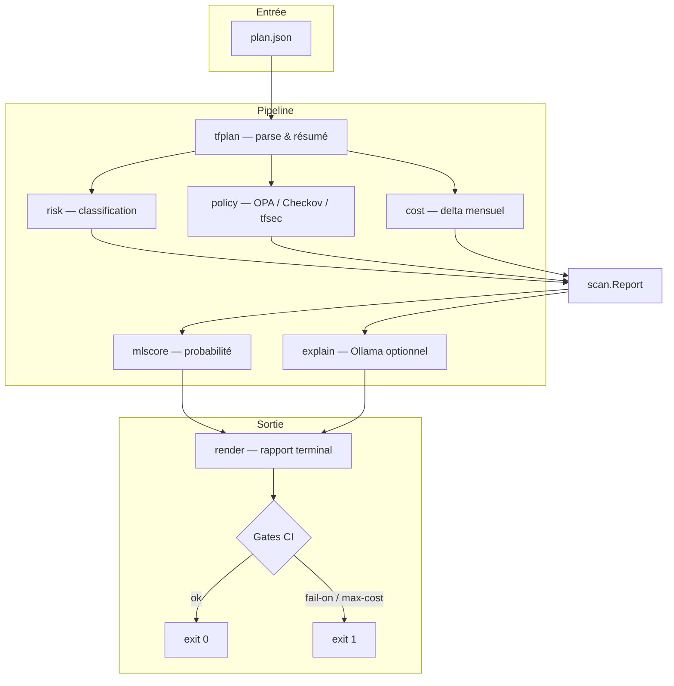

# tfguard

**Revueur de plans Terraform pour AWS** — parse `terraform plan -json`, classifie le risque, exécute les policies de sécurité, estime l'impact coût, score ML, et bloque la CI avant `terraform apply`.

[](https://go.dev/)
[](https://www.terraform.io/)
[](https://www.openpolicyagent.org/)
[](https://github.com/SamyBaouche/tfguard/releases/tag/v0.1.0)

> [English](README.md) · **Français**

---

## Table des matières

- [Démo](#démo)
- [C'est quoi tfguard ?](#cest-quoi-tfguard-)
- [Fonctionnalités](#fonctionnalités)
- [Comment ça marche](#comment-ça-marche)
- [Installation](#installation)
- [Démarrage rapide](#démarrage-rapide)
- [Générer un plan Terraform JSON](#générer-un-plan-terraform-json)
- [Référence CLI](#référence-cli)
- [Sections du rapport](#sections-du-rapport)
- [Modèle de risque](#modèle-de-risque)
- [Policies de sécurité](#policies-de-sécurité)
- [Estimation de coût](#estimation-de-coût)
- [Score ML](#score-ml)
- [Explainer IA (optionnel)](#explainer-ia-optionnel)
- [Intégration CI/CD](#intégration-cicd)
- [GitHub Action](#github-action)
- [Structure du projet](#structure-du-projet)
- [Développement](#développement)
- [Roadmap](#roadmap)
- [Licence](#licence)

---

## Démo


> **Ajoute tes propres captures** dans `docs/images/` :
>
> | Image | Fichier suggéré | Contenu à capturer |
> |-------|-----------------|-------------------|
> | Rapport complet | `docs/images/report-full.png` | Sortie complète du `scan` |
> | Architecture | `docs/images/architecture.png` | Schéma du pipeline |
> | Drivers de coût | `docs/images/cost-drivers.png` | Table top 3 cost drivers |
> | Commentaire PR GitHub | `docs/images/ci-pr-comment.png` | Commentaire de l'Action sur une PR |
> | Matrice de risque | `docs/images/risk-matrix.png` | Légende SAFE → CRITICAL |

<!-- Décommente quand tu ajoutes les screenshots :


-->

---

## C'est quoi tfguard ?

Un **`terraform plan` qui réussit ≠ un changement sûr.**

Les gros plans cachent des actions destructives (suppression RDS, SG ouverts, resize d'instances). **tfguard** lit le JSON du plan **avant apply** et produit une revue structurée :

| Dimension | Question répondue |
|-----------|-------------------|
| **Risque** | Quel danger pour chaque changement ? (`SAFE` → `CRITICAL`) |
| **Sécurité** | Violations de policies ? (OPA, Checkov, tfsec) |
| **Coût** | Delta mensuel AWS approximatif ? |
| **ML** | Probabilité que le plan soit à haut risque ? |
| **IA** | (Optionnel) Résumé en langage clair via Ollama local |
| **Gate CI** | Faut-il bloquer le pipeline ? (`--fail-on`, `--max-cost-increase`) |

tfguard **ne déploie pas** l'infra. Il **review** le plan et peut **bloquer la CI** avec un exit code non-zéro.

---

## Fonctionnalités

### Cœur du produit

- **Parse du plan** — décode `terraform show -json` ; collapse `["delete","create"]` en `replace`
- **Résumé des mutations** — compte create / update / replace / delete ; ignore no-ops et data sources
- **Classification de risque** — niveaux par règles + **escalade stateful** (RDS, S3, EBS, DynamoDB…)
- **Scan policies** — **OPA/Rego** embarqué (5 règles) + **Checkov** / **tfsec** optionnels
- **Delta coût** — prix statiques us-east-1 (~20 SKUs) ; **top 3 drivers**
- **Score ML** — régression logistique embarquée (**F1 0.99** sur hold-out)
- **Explainer LLM** — résumé Ollama optionnel avec schéma JSON + cache SHA-256
- **Rapport terminal** — boîtes colorées, tableaux, spinner, bannière
- **Gates CI** — `--fail-on` (risque + findings) et `--max-cost-increase` (FinOps)

### Release & automation

- **v0.1.0** publiée via **GoReleaser** (6 plateformes)
- **GitHub Action** (`action.yml`) — scan + commentaire sur les PR
- **Workflow CI** — `go test` + `go vet` à chaque push

---

## Comment ça marche



| Couche | Package | Rôle |
|--------|---------|------|
| Parse | `internal/tfplan` | Lire le plan JSON |
| Risque | `internal/risk` | Noter chaque changement |
| Policy | `internal/policy` | OPA + Checkov/tfsec |
| Coût | `internal/cost` | Delta mensuel AWS statique |
| ML | `internal/mlscore` | Probabilité haut risque |
| Explain | `internal/explain` | Résumé Ollama (`--no-ai` pour skip) |
| Orchestration | `internal/scan` | Rapport + gates CI |
| Affichage | `internal/render` + `internal/ui` | Rapport terminal |
| CLI | `cmd/tfguard` | Commandes `scan`, `version` |

Checkov/tfsec manquants → **warning** seulement, pas de crash.

---

## Installation

### Option A — Build depuis les sources

**Prérequis :** Go 1.26+

```bash
git clone https://github.com/SamyBaouche/tfguard.git
cd tfguard
make build
./bin/tfguard version
```

### Option B — Binaire release

Télécharge depuis [Releases v0.1.0](https://github.com/SamyBaouche/tfguard/releases/tag/v0.1.0) :

| Plateforme | Archive |
|------------|---------|
| Linux amd64 | `tfguard_0.1.0_linux_amd64.tar.gz` |
| Linux arm64 | `tfguard_0.1.0_linux_arm64.tar.gz` |
| macOS amd64 | `tfguard_0.1.0_darwin_amd64.tar.gz` |
| macOS arm64 (Apple Silicon) | `tfguard_0.1.0_darwin_arm64.tar.gz` |
| Windows amd64 | `tfguard_0.1.0_windows_amd64.tar.gz` |
| Windows arm64 | `tfguard_0.1.0_windows_arm64.tar.gz` |

### Dépendances optionnelles

| Outil | Usage | Obligatoire ? |
|-------|-------|---------------|
| **Ollama** | Explainer IA | Non (`--no-ai`) |
| **Checkov** | Scan HCL | Non |
| **tfsec** | Scan sécurité HCL | Non |
| **Terraform** | Générer `plan.json` | Seulement pour vraie infra |

---

## Démarrage rapide

### Tester avec les fixtures (sans Terraform)

```bash
make build

# Plan complet (create + update + delete + replace)
./bin/tfguard scan --plan testdata/plan_mixed.json --no-ai --no-banner

# Plan minimal
./bin/tfguard scan --plan testdata/plan_minimal.json --no-ai --no-banner

# Plan avec replace
./bin/tfguard scan --plan testdata/plan_replace.json --no-ai --no-banner
```

Résultat attendu sur `plan_mixed.json` :
- **Risque max :** `CRITICAL` (delete `aws_db_instance.main`)
- **Coût :** `+7.59 USD/mo` (t3.micro → t3.small)
- **ML :** probabilité haut risque affichée dans l'en-tête

### Expérience complète (bannière + spinner)

```bash
./bin/tfguard scan --plan testdata/plan_mixed.json --no-ai
```

`NO_COLOR=1` pour sortie sans couleurs ANSI.

---

## Générer un plan Terraform JSON

À exécuter **dans ton projet Terraform** (dossier avec fichiers `.tf`), pas dans le repo tfguard :

```bash
cd /chemin/vers/ton/projet-terraform
terraform init
terraform plan -out=plan.tfplan
terraform show -json plan.tfplan > plan.json
```

Puis :

```bash
tfguard scan --plan plan.json --no-ai
```

Avec scanners HCL :

```bash
tfguard scan --plan plan.json --dir . --no-ai
```

---

## Référence CLI

### Commandes

```bash
tfguard scan --plan <chemin>   # Analyser un plan JSON
tfguard version                # Afficher la version
tfguard --help                 # Aide
```

### Flags `scan`

| Flag | Description | Défaut |
|------|-------------|--------|
| `--plan` | Chemin vers le plan JSON | **obligatoire** |
| `--dir` | Racine Terraform pour Checkov/tfsec | — |
| `--fail-on` | Exit 1 au niveau : `SAFE\|CAUTION\|DANGER\|CRITICAL` | désactivé |
| `--max-cost-increase` | Exit 1 si delta coût USD/mo dépasse la valeur | désactivé |
| `--no-ai` | Skip l'explainer Ollama | false |
| `--ollama-url` | URL base Ollama | `http://127.0.0.1:11434` |
| `--ollama-model` | Modèle Ollama | `llama3.2` |
| `--skip-checkov` | Ne pas lancer Checkov | false |
| `--skip-tfsec` | Ne pas lancer tfsec | false |
| `--skip-opa` | Ne pas lancer OPA | false |
| `--skip-cost` | Ne pas estimer le coût | false |
| `--no-banner` | Skip la bannière animée | false |

### Codes de sortie

| Code | Signification |
|------|---------------|
| `0` | Scan OK ; gates passées |
| `1` | Gate déclenchée ou erreur runtime |
| `2` | Erreur d'usage (flag invalide, `--plan` manquant) |

### Recettes courantes

```bash
# Revue basique
tfguard scan --plan plan.json --no-ai

# CI : bloquer les plans dangereux
tfguard scan --plan plan.json --fail-on DANGER --no-ai

# CI : bloquer si coût > 50 $/mois
tfguard scan --plan plan.json --max-cost-increase 50 --no-ai

# Strict : bloquer dès CAUTION
tfguard scan --plan plan.json --fail-on CAUTION --no-ai

# Scanners HCL + toutes les gates
tfguard scan --plan plan.json --dir ./infra --fail-on CRITICAL --max-cost-increase 100 --no-ai

# Dev local avec résumé IA (Ollama requis)
ollama pull llama3.2
tfguard scan --plan plan.json

# Scan rapide : sans coût ni IA
tfguard scan --plan plan.json --skip-cost --no-ai --no-banner
```

---

## Sections du rapport

| Section | Contenu |
|---------|---------|
| **Scan report** | Chemin plan, risque max, probabilité ML |
| **Summary** | Compteurs create / update / replace / delete |
| **Cost estimate** | Delta USD/mo, ressources pricées vs non pricées |
| **Top cost drivers** | Top 3 ressources par \|delta\| |
| **Changes** | Tableau RISK · ACTION · TYPE · ADDRESS |
| **Policy findings** | Tableau SEV · SOURCE · ID · RESOURCE · TITLE |
| **Warnings** | Checkov/tfsec/Ollama manquants |
| **AI summary** | (si Ollama) résumé, risques, recommandations |
| **Footer** | Totaux + delta coût |

---

## Modèle de risque

| Action | Niveau de base | Si stateful (+1) |
|--------|----------------|------------------|
| create / no-op / read | `SAFE` | `CAUTION` |
| update | `CAUTION` | `DANGER` |
| replace / delete | `DANGER` | `CRITICAL` |

**Ressources stateful :** RDS, S3, EBS, DynamoDB, EFS, ElastiCache, Redshift, OpenSearch, DocumentDB, Neptune.

`--fail-on` mappe aussi la sévérité des findings : `CRITICAL`→`CRITICAL`, `HIGH`→`DANGER`, `MEDIUM`→`CAUTION`.

---

## Policies de sécurité

Rego embarqué dans `policies/` :

| ID | Détecte |
|----|---------|
| `TFGUARD-S3-001` | Bucket S3 public |
| `TFGUARD-SG-001` | Security group ouvert à `0.0.0.0/0` |
| `TFGUARD-RDS-001` | RDS sans `storage_encrypted` |
| `TFGUARD-IAM-001` | Policy IAM avec `Action: "*"` |
| `TFGUARD-EBS-001` | Volume EBS non chiffré |

Scanners externes optionnels (nécessitent `--dir`) :
- **Checkov** — moteur de policies IaC
- **tfsec** — scanner sécurité Terraform

---

## Estimation de coût

Prix statiques **us-east-1 on-demand** (~20 SKUs).

Pour chaque changement :
1. Décode le JSON `before` / `after`
2. Extrait les attributs facturables
3. Calcule le coût mensuel avant, après, et le delta
4. Affiche les **3 principaux drivers**

```bash
tfguard scan --plan plan.json --max-cost-increase 50 --no-ai
```

> **Note :** estimation pour **review de plan**, pas facture AWS réelle.

| Ressource | Attributs lus |
|-----------|---------------|
| `aws_instance` | `instance_type` |
| `aws_db_instance` | `instance_class`, `allocated_storage` |
| `aws_ebs_volume` | `size` |
| NAT Gateway, ALB, EIP | prix fixe mensuel |

---

## Score ML

Régression logistique entraînée sur ~250 plans synthétiques labellisés.

| Élément | Détail |
|---------|--------|
| Dataset | `scripts/generate_dataset.py` |
| Entraînement | `scripts/train_model.py` |
| Inférence | `go:embed` dans le binaire |
| Métriques hold-out | **precision 1.00 · recall 0.98 · F1 0.99** |

Réentraîner :

```bash
python3 scripts/generate_dataset.py
python3 scripts/train_model.py
make test
```

---

## Explainer IA (optionnel)

Avec **Ollama** local, tfguard envoie un contexte JSON compact et affiche :
- `summary` — vue d'ensemble
- `risks` — liste de risques (max 5)
- `recommendations` — prochaines étapes (max 5)
- `cost_note` — impact coût

Cache SHA-256 : `$XDG_CACHE_HOME/tfguard/explain/`

```bash
ollama pull llama3.2
tfguard scan --plan plan.json
```

En CI : toujours `--no-ai`.

---

## Intégration CI/CD

```yaml
- name: Terraform Plan
  run: |
    terraform plan -out=plan.tfplan
    terraform show -json plan.tfplan > plan.json

- name: tfguard scan
  run: |
    tfguard scan \
      --plan plan.json \
      --dir ./infra \
      --fail-on DANGER \
      --max-cost-increase 50 \
      --no-ai

- name: Terraform Apply
  if: success()
  run: terraform apply plan.tfplan
```

---

## GitHub Action

```yaml
name: Revue plan Terraform

on:
  pull_request:

jobs:
  tfguard:
    runs-on: ubuntu-latest
    steps:
      - uses: actions/checkout@v4

      - name: Setup Terraform
        uses: hashicorp/setup-terraform@v3

      - name: Terraform Plan
        working-directory: infra
        run: |
          terraform init
          terraform plan -out=plan.tfplan
          terraform show -json plan.tfplan > ../plan.json

      - name: tfguard scan
        uses: ./
        with:
          plan-path: plan.json
          terraform-dir: infra
          fail-on: DANGER
          max-cost-increase: "50"
          no-ai: "true"
```

L'Action **commente le rapport sur la PR**.

---

## Structure du projet

```text
tfguard/
├── cmd/tfguard/          Point d'entrée CLI
├── internal/
│   ├── tfplan/           Parse plan JSON
│   ├── risk/             Classification SAFE → CRITICAL
│   ├── policy/           OPA + Checkov + tfsec
│   ├── cost/             Delta coût AWS
│   ├── mlscore/          Modèle ML embarqué
│   ├── explain/          Explainer Ollama
│   ├── scan/             Orchestration + gates CI
│   ├── render/           Formatage rapport
│   └── ui/               Couleurs, spinner, bannière
├── policies/             Règles Rego embarquées
├── scripts/              Dataset, entraînement ML, GIF démo
├── testdata/             Fixtures JSON pour tests
├── docs/
│   ├── demo.gif          GIF animé CLI
│   └── images/           Tes captures d'écran ici
├── data/                 Dataset ML + métriques
├── action.yml            GitHub Action
└── .github/workflows/    CI + release
```

Module : `github.com/SamyBaouche/tfguard`

---

## Développement

```bash
make test      # tests + coverage
make vet       # go vet
make fmt       # go fmt
make build     # compile bin/tfguard
make clean     # supprime bin/
```

Voir [CONTRIBUTING.md](CONTRIBUTING.md).

Regénérer le GIF démo :

```bash
python3 -m venv .venv
.venv/bin/pip install pillow
.venv/bin/python scripts/generate_demo_gif.py
```

---

## Roadmap

| Statut | Item |
|--------|------|
| ✅ Fait | Parse, risk, policies, CLI, coût, ML, Ollama, GitHub Action, v0.1.0 |
| 🔜 Prévu | Dataset ML plus riche (vrais plans Terraform) |
| 🔜 Prévu | Plus de SKUs AWS + API Pricing dynamique |
| 🔜 Prévu | Dossier `examples/` avec mini projet Terraform |

---

## Licence

Apache 2.0 — voir [LICENSE](LICENSE).
