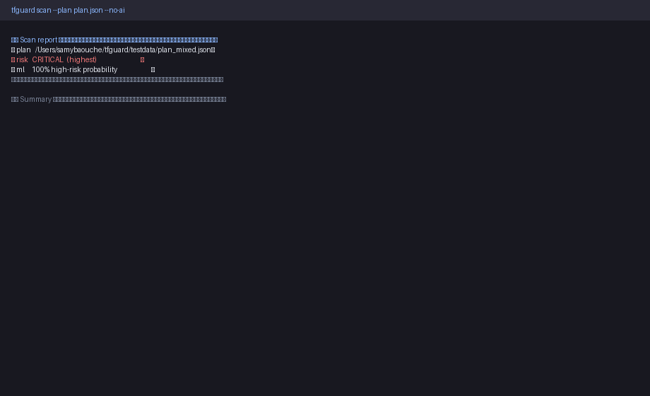
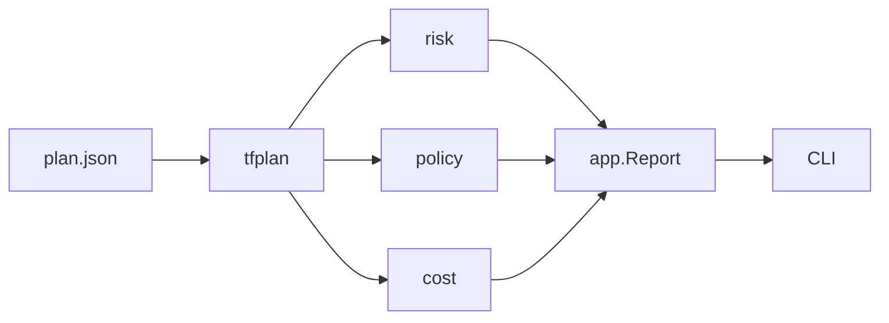

# tfguard

**Langue :** [English](README.md) | Français



Revue de plans Terraform (AWS) : parse du JSON, classification de risque (`SAFE` → `CRITICAL`), policies OPA (et Checkov/tfsec optionnels), échec CI via `-fail-on`.

## Pipeline



| Couche | Package | Role |
|--------|---------|------|
| Parse | `internal/tfplan` | Lire le plan JSON |
| Risque | `internal/risk` | Noter chaque changement |
| Policy | `internal/policy` | OPA + scanners optionnels |
| Coût | `internal/cost` | Delta mensuel AWS statique |
| Orchestration | `internal/app` | Rapport + fail-on / max-cost-increase |
| CLI | `cmd/tfguard` | Commandes Cobra : `scan`, `version` |

## Usage

```bash
make build
./bin/tfguard scan --plan plan.json
./bin/tfguard scan --plan plan.json --dir ./infra --fail-on DANGER
./bin/tfguard scan --plan plan.json --max-cost-increase 50
```

Codes de sortie : `0` ok · `1` seuil / erreur · `2` usage.

## Risque

create → `SAFE` · update → `CAUTION` · replace/delete → `DANGER`  
Stateful (RDS, S3, EBS…) → +1 (max `CRITICAL`).

## Coût

Prix statiques us-east-1 (~20 SKUs). Extrait les attributs before/after, calcule le delta mensuel, affiche les 3 principaux drivers. `--max-cost-increase` échoue la CI si le delta dépasse le plafond.

## Roadmap

Fait : parse, risk, policies, CLI, estimation de coût AWS.  
Prévu : score ML, explainer LLM, GitHub Action.

## Licence

Apache 2.0 — voir [LICENSE](LICENSE).
