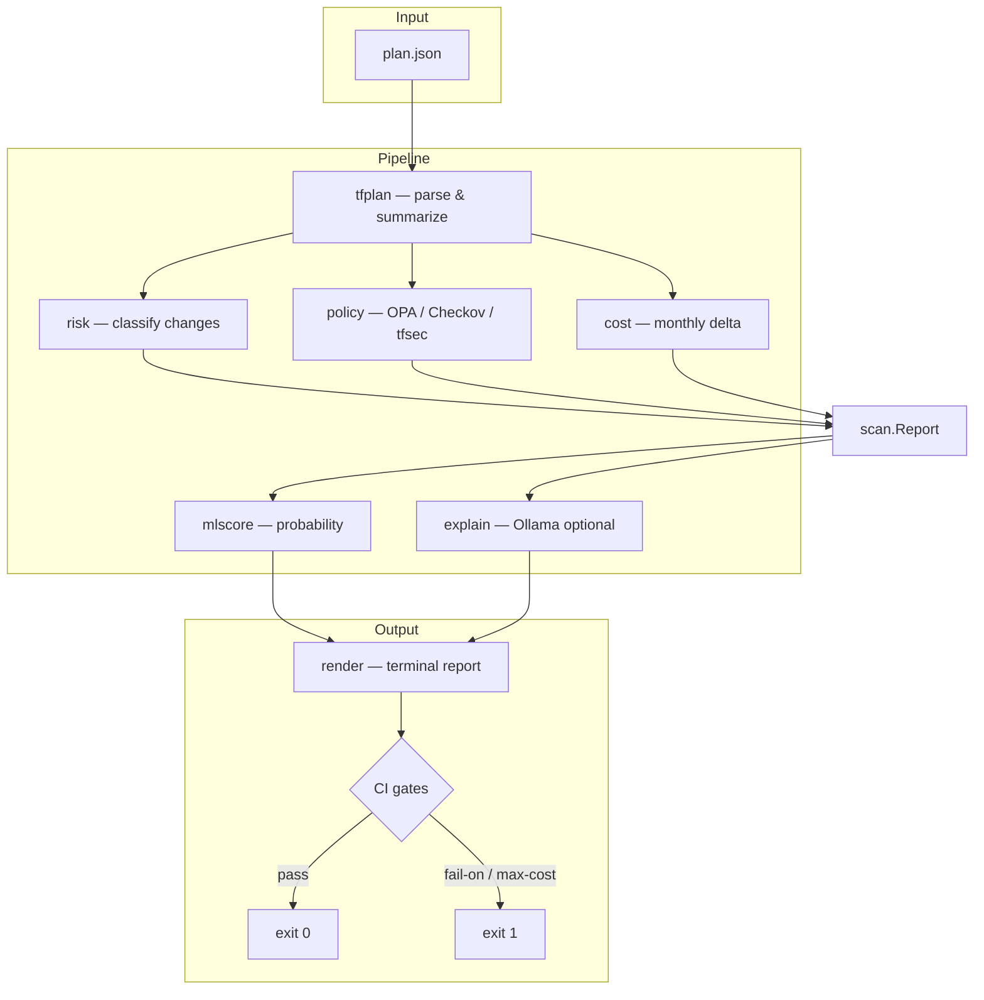

# tfguard

**Terraform plan reviewer for AWS** — parse `terraform plan -json`, classify change risk, run security policies, estimate cost impact, score ML risk, and gate CI before `terraform apply`.

[](https://go.dev/)
[](https://www.terraform.io/)
[](https://www.openpolicyagent.org/)
[](https://github.com/SamyBaouche/tfguard/releases/tag/v0.1.0)

> **English** · Read in [Français](README.fr.md)

---

## Table of contents

- [Demo](#demo)
- [What is tfguard?](#what-is-tfguard)
- [Features](#features)
- [How it works](#how-it-works)
- [Installation](#installation)
- [Quick start](#quick-start)
- [Generate a Terraform plan JSON](#generate-a-terraform-plan-json)
- [CLI reference](#cli-reference)
- [Report sections](#report-sections)
- [Risk model](#risk-model)
- [Security policies](#security-policies)
- [Cost estimation](#cost-estimation)
- [ML risk score](#ml-risk-score)
- [AI explainer (optional)](#ai-explainer-optional)
- [CI/CD integration](#cicd-integration)
- [GitHub Action](#github-action)
- [Project structure](#project-structure)
- [Development](#development)
- [Roadmap](#roadmap)
- [License](#license)

---

## Demo


> **Add your own screenshots** under `docs/images/` and embed them below:
>
> | Image | Suggested file | What to capture |
> |-------|----------------|-----------------|
> | Full terminal report | `docs/images/report-full.png` | Complete `scan` output |
> | Architecture diagram | `docs/images/architecture.png` | Pipeline / boxes diagram |
> | Cost drivers section | `docs/images/cost-drivers.png` | Top 3 cost drivers table |
> | GitHub Action PR comment | `docs/images/ci-pr-comment.png` | PR comment from Action |
> | Risk matrix | `docs/images/risk-matrix.png` | SAFE → CRITICAL legend |

<!-- Uncomment when you add screenshots:


-->

---

## What is tfguard?

A **`terraform plan` succeeds ≠ a safe change.**

Large plans hide destructive actions (delete RDS, open security groups, resize instances). **tfguard** reads the plan JSON **before apply** and produces a structured review:

| Dimension | What tfguard answers |
|-----------|----------------------|
| **Risk** | How dangerous is each change? (`SAFE` → `CRITICAL`) |
| **Security** | Does the plan violate policies? (OPA, Checkov, tfsec) |
| **Cost** | What is the approximate monthly AWS delta? |
| **ML** | What is the probability this plan is high-risk? |
| **AI** | (Optional) Plain-language summary via local Ollama |
| **CI gate** | Should the pipeline fail? (`--fail-on`, `--max-cost-increase`) |

tfguard **does not deploy** infrastructure. It **reviews** the plan and can **block CI** with a non-zero exit code.

---

## Features

### Core

- **Plan parsing** — decode `terraform show -json` output; collapse `["delete","create"]` into `replace`
- **Mutation summary** — count create / update / replace / delete; skip no-ops and data sources
- **Risk classification** — rule-based levels with **stateful escalation** (RDS, S3, EBS, DynamoDB, …)
- **Policy scanning** — embedded **OPA/Rego** (5 rules) + optional **Checkov** / **tfsec**
- **Cost delta** — static us-east-1 pricing (~20 SKUs); top **3 cost drivers**
- **ML score** — embedded logistic regression (**F1 0.99** on hold-out set)
- **LLM explainer** — optional Ollama summary with JSON schema + SHA-256 cache
- **Terminal report** — colored boxes, tables, spinner, banner
- **CI gates** — `--fail-on` (risk + findings) and `--max-cost-increase` (FinOps)

### Release & automation

- **v0.1.0** published via **GoReleaser** (6 platforms)
- **GitHub Action** (`action.yml`) — runs scan and comments on PRs
- **CI workflow** — `go test` + `go vet` on every push

---

## How it works



| Layer | Package | Responsibility |
|-------|---------|----------------|
| Parse | `internal/tfplan` | Decode plan JSON; collapse actions; summarize mutations |
| Risk | `internal/risk` | Score each change; escalate stateful AWS types |
| Policy | `internal/policy` | OPA Rego (embedded) + optional Checkov/tfsec |
| Cost | `internal/cost` | Static AWS monthly delta from before/after attributes |
| ML score | `internal/mlscore` | Embedded logistic regression high-risk probability |
| Explain | `internal/explain` | Optional Ollama LLM summary (`--no-ai` to skip) |
| Orchestrate | `internal/scan` | Build `Report`; evaluate gates |
| Present | `internal/render` + `internal/ui` | Terminal report + styling |
| CLI | `cmd/tfguard` | Cobra commands: `scan`, `version` |

Optional scanners (Checkov/tfsec) emit **warnings** when missing — they do not crash the run.

---

## Installation

### Option A — Build from source

**Requirements:** Go 1.26+

```bash
git clone https://github.com/SamyBaouche/tfguard.git
cd tfguard
make build
./bin/tfguard version
```

### Option B — Download release binary

Pick your platform from [Releases v0.1.0](https://github.com/SamyBaouche/tfguard/releases/tag/v0.1.0):

| Platform | Archive |
|----------|---------|
| Linux amd64 | `tfguard_0.1.0_linux_amd64.tar.gz` |
| Linux arm64 | `tfguard_0.1.0_linux_arm64.tar.gz` |
| macOS amd64 | `tfguard_0.1.0_darwin_amd64.tar.gz` |
| macOS arm64 | `tfguard_0.1.0_darwin_arm64.tar.gz` |
| Windows amd64 | `tfguard_0.1.0_windows_amd64.tar.gz` |
| Windows arm64 | `tfguard_0.1.0_windows_arm64.tar.gz` |

```bash
tar -xzf tfguard_0.1.0_linux_amd64.tar.gz
./tfguard version
```

### Optional dependencies

| Tool | Purpose | Required? |
|------|---------|-----------|
| **Ollama** | AI explainer | No (`--no-ai` skips it) |
| **Checkov** | HCL policy scan | No (warning if missing) |
| **tfsec** | HCL security scan | No (warning if missing) |
| **Terraform** | Generate `plan.json` | Only for real infra review |

---

## Quick start

### Test with bundled fixtures (no Terraform needed)

```bash
make build

# Full demo plan (create + update + delete + replace)
./bin/tfguard scan --plan testdata/plan_mixed.json --no-ai --no-banner

# Minimal plan
./bin/tfguard scan --plan testdata/plan_minimal.json --no-ai --no-banner

# Replace-only plan
./bin/tfguard scan --plan testdata/plan_replace.json --no-ai --no-banner
```

Expected on `plan_mixed.json`:
- **Max risk:** `CRITICAL` (delete `aws_db_instance.main`)
- **Cost delta:** `+7.59 USD/mo` (t3.micro → t3.small)
- **ML score:** high-risk probability displayed in header

### Full experience (banner + spinner)

```bash
./bin/tfguard scan --plan testdata/plan_mixed.json --no-ai
```

Set `NO_COLOR=1` for plain output without ANSI colors.

---

## Generate a Terraform plan JSON

Run these commands **inside your Terraform project** (folder with `.tf` files), not inside the tfguard repo:

```bash
cd /path/to/your/terraform-project
terraform init
terraform plan -out=plan.tfplan
terraform show -json plan.tfplan > plan.json
```

Then scan:

```bash
tfguard scan --plan plan.json --no-ai
```

With HCL scanners:

```bash
tfguard scan --plan plan.json --dir . --no-ai
```

---

## CLI reference

### Commands

```bash
tfguard scan --plan <path>   # Analyze a plan JSON
tfguard version              # Print version
tfguard --help               # Help
```

### `scan` flags

| Flag | Description | Default |
|------|-------------|---------|
| `--plan` | Path to terraform plan JSON | **required** |
| `--dir` | Terraform root for Checkov/tfsec | — |
| `--fail-on` | Exit 1 at level: `SAFE\|CAUTION\|DANGER\|CRITICAL` | disabled |
| `--max-cost-increase` | Exit 1 if monthly cost delta USD exceeds value | disabled |
| `--no-ai` | Skip Ollama LLM explainer | false |
| `--ollama-url` | Ollama base URL | `http://127.0.0.1:11434` |
| `--ollama-model` | Ollama model name | `llama3.2` |
| `--skip-checkov` | Do not run Checkov | false |
| `--skip-tfsec` | Do not run tfsec | false |
| `--skip-opa` | Do not run OPA policies | false |
| `--skip-cost` | Do not estimate cost delta | false |
| `--no-banner` | Skip animated banner | false |

### Exit codes

| Code | Meaning |
|------|---------|
| `0` | Scan OK; gates passed |
| `1` | Gate triggered (`--fail-on` / `--max-cost-increase`) or runtime error |
| `2` | Usage error (missing `--plan`, invalid flag, etc.) |

### Common recipes

```bash
# Basic review
tfguard scan --plan plan.json --no-ai

# CI: block dangerous plans
tfguard scan --plan plan.json --fail-on DANGER --no-ai

# CI: block cost increases over $50/mo
tfguard scan --plan plan.json --max-cost-increase 50 --no-ai

# Strict: block at CAUTION
tfguard scan --plan plan.json --fail-on CAUTION --no-ai

# With HCL scanners + all gates
tfguard scan --plan plan.json --dir ./infra --fail-on CRITICAL --max-cost-increase 100 --no-ai

# Local dev with AI summary (requires Ollama)
ollama pull llama3.2
tfguard scan --plan plan.json

# Fast scan: skip cost + AI
tfguard scan --plan plan.json --skip-cost --no-ai --no-banner
```

---

## Report sections

When you run `scan`, the terminal report includes:

| Section | Content |
|---------|---------|
| **Scan report** | Plan path, max risk, ML probability |
| **Summary** | Counts: create / update / replace / delete |
| **Cost estimate** | Monthly delta USD, priced vs unpriced resources |
| **Top cost drivers** | Top 3 resources by \|delta\| |
| **Changes** | Table: RISK · ACTION · TYPE · ADDRESS |
| **Policy findings** | Table: SEV · SOURCE · ID · RESOURCE · TITLE |
| **Warnings** | Missing Checkov/tfsec, Ollama unavailable, etc. |
| **AI summary** | (if Ollama enabled) summary, risks, recommendations |
| **Footer** | Totals + cost delta |

Example (abridged):

```text
╭─ Scan report ────────────────────────────────────────────╮
│ plan   plan.json                                         │
│ risk   CRITICAL  (highest)                               │
│ ml     87% high-risk probability                         │
╰──────────────────────────────────────────────────────────╯

╭─ Summary ────────────────────────────────────────────────╮
│ create 1   update 1   replace 1   delete 1               │
╰──────────────────────────────────────────────────────────╯

▸ Changes
  RISK      ACTION   TYPE                ADDRESS
  CRITICAL  delete   aws_db_instance     aws_db_instance.main
  CAUTION   update   aws_instance        aws_instance.web
  ...
```

---

## Risk model

| Action | Base level | If stateful (+1) |
|--------|------------|------------------|
| create / no-op / read | `SAFE` | `CAUTION` |
| update | `CAUTION` | `DANGER` |
| replace / delete | `DANGER` | `CRITICAL` |

**Stateful types** (data-bearing): RDS, S3, EBS, DynamoDB, EFS, ElastiCache, Redshift, OpenSearch, DocumentDB, Neptune.

`--fail-on` also maps finding severity: `CRITICAL`→`CRITICAL`, `HIGH`→`DANGER`, `MEDIUM`→`CAUTION`.

---

## Security policies

Embedded Rego under `policies/` (compiled into the binary):

| ID | Catches |
|----|---------|
| `TFGUARD-S3-001` | Public S3 ACL |
| `TFGUARD-SG-001` | Security group open to `0.0.0.0/0` |
| `TFGUARD-RDS-001` | RDS without `storage_encrypted` |
| `TFGUARD-IAM-001` | IAM policy with `Action: "*"` |
| `TFGUARD-EBS-001` | Unencrypted EBS volume |

Optional external scanners (require `--dir` pointing to Terraform HCL):

- **Checkov** — broad IaC policy engine
- **tfsec** — Terraform security scanner

---

## Cost estimation

Static **us-east-1 on-demand** prices (~20 SKUs: EC2, RDS, ElastiCache, NAT Gateway, ALB, EIP, …).

For each mutating change, tfguard:
1. Decodes `before` / `after` JSON attributes
2. Extracts billable fields (`instance_type`, `instance_class`, `allocated_storage`, …)
3. Computes monthly USD before, after, and delta
4. Shows the **top 3 drivers** by absolute delta

```bash
tfguard scan --plan plan.json --max-cost-increase 50 --no-ai
```

> **Note:** figures are for **plan review**, not AWS billing accuracy. S3/DynamoDB usage-driven resources are often unpriced.

Supported pricing signals:

| Resource | Attributes read |
|----------|-----------------|
| `aws_instance` | `instance_type` |
| `aws_db_instance` | `instance_class`, `allocated_storage` |
| `aws_ebs_volume` | `size` |
| `aws_nat_gateway`, `aws_lb`, `aws_eip` | fixed monthly |
| ElastiCache / Redshift | `node_type`, node count |

---

## ML risk score

Trained **logistic regression** on ~250 synthetic labeled plans.

| Item | Detail |
|------|--------|
| Dataset | `scripts/generate_dataset.py` → `data/risk_dataset.json` |
| Training | `scripts/train_model.py` → `internal/mlscore/model.json` |
| Inference | Embedded via `go:embed` at build time |
| Features | change counts, stateful mutations, finding severities, cost delta, max action level |
| Hold-out metrics | **precision 1.00 · recall 0.98 · F1 0.99** (seed=42) |

Retrain the model:

```bash
python3 scripts/generate_dataset.py
python3 scripts/train_model.py
make test
```

---

## AI explainer (optional)

When **Ollama** is running locally, tfguard sends a compact JSON context (changes + findings + cost) to `/api/generate` and prints:

- `summary` — 2–3 sentence overview
- `risks` — bullet list (max 5)
- `recommendations` — bullet list (max 5)
- `cost_note` — one sentence on cost impact

Responses are cached by SHA-256 under `$XDG_CACHE_HOME/tfguard/explain/`.

```bash
ollama serve          # if not running
ollama pull llama3.2
tfguard scan --plan plan.json
```

For CI, always use `--no-ai`. If Ollama is unavailable, tfguard prints a warning and continues.

---

## CI/CD integration

Typical pipeline:

```yaml
- name: Terraform Plan
  run: |
    terraform plan -out=plan.tfplan
    terraform show -json plan.tfplan > plan.json

- name: tfguard scan
  run: |
    tfguard scan \
      --plan plan.json \
      --dir ./infra \
      --fail-on DANGER \
      --max-cost-increase 50 \
      --no-ai

- name: Terraform Apply
  if: success()
  run: terraform apply plan.tfplan
```

---

## GitHub Action

Use the repo root `action.yml`:

```yaml
name: Terraform Plan Review

on:
  pull_request:

jobs:
  tfguard:
    runs-on: ubuntu-latest
    steps:
      - uses: actions/checkout@v4

      - name: Setup Terraform
        uses: hashicorp/setup-terraform@v3

      - name: Terraform Plan
        working-directory: infra
        run: |
          terraform init
          terraform plan -out=plan.tfplan
          terraform show -json plan.tfplan > ../plan.json

      - name: tfguard scan
        uses: ./
        with:
          plan-path: plan.json
          terraform-dir: infra
          fail-on: DANGER
          max-cost-increase: "50"
          no-ai: "true"
```

The Action builds tfguard, runs the scan, and **comments the report on the PR**.

---

## Project structure

```text
tfguard/
├── cmd/tfguard/          CLI entrypoint (scan, version)
├── internal/
│   ├── tfplan/           Parse plan JSON + summarize
│   ├── risk/             SAFE → CRITICAL classification
│   ├── policy/           OPA + Checkov + tfsec
│   ├── cost/             Static AWS cost delta
│   ├── mlscore/          Embedded ML model + inference
│   ├── explain/          Ollama LLM explainer + cache
│   ├── scan/             Pipeline orchestration + CI gates
│   ├── render/           Terminal report formatting
│   └── ui/               Colors, boxes, banner, spinner
├── policies/             Embedded Rego rules (.rego)
├── scripts/              Dataset generation, model training, demo GIF
├── testdata/             Plan JSON fixtures for tests
├── docs/
│   ├── demo.gif          Animated CLI demo
│   └── images/           Screenshots (add yours here)
├── data/                 ML dataset + metrics
├── action.yml            GitHub Action composite
├── .goreleaser.yaml      Multi-platform release config
└── .github/workflows/    CI + release pipelines
```

Module path: `github.com/SamyBaouche/tfguard`

---

## Development

```bash
make test      # go test ./... -cover
make vet       # go vet ./...
make fmt       # go fmt ./...
make build     # build bin/tfguard
make clean     # remove bin/
```

Guidelines:
- Table-driven tests + fixtures over live Terraform
- Wrap errors with `%w`
- Optional tools (Checkov, tfsec, Ollama) soft-fail with warnings
- Packages under `internal/` until a public API is intentional

See [CONTRIBUTING.md](CONTRIBUTING.md).

Regenerate demo GIF:

```bash
python3 -m venv .venv
.venv/bin/pip install pillow
.venv/bin/python scripts/generate_demo_gif.py
```

---

## Roadmap

| Status | Item |
|--------|------|
| ✅ Done | Plan parse, risk, policies, CLI, cost delta, ML score, Ollama explainer |
| ✅ Done | GitHub Action, GoReleaser v0.1.0, demo GIF, LICENSE, CONTRIBUTING |
| 🔜 Planned | Richer ML dataset (real Terraform plans) |
| 🔜 Planned | More AWS SKUs + dynamic pricing API |
| 🔜 Planned | `examples/` mini Terraform project for end-to-end testing |

---

## License

Apache 2.0 — see [LICENSE](LICENSE).
